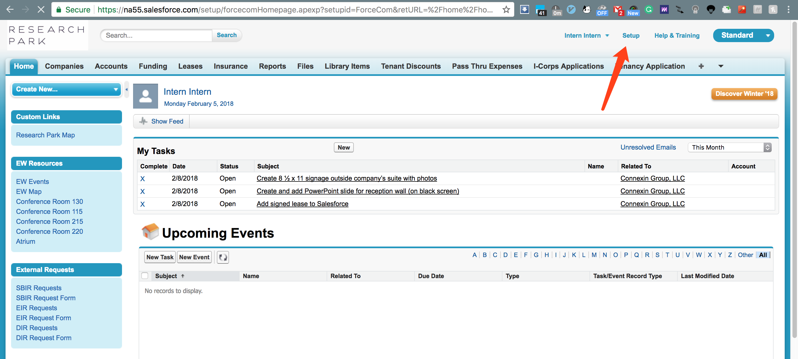
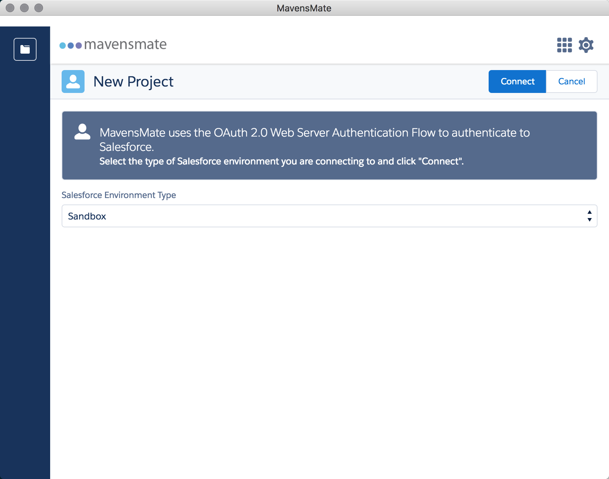

# rp-form
Salesforce form template for ResearchPark

## Development Instruction

### Preparation

The instruction is for MacOS.

1. Install [Homebrew](https://brew.sh/)
2. Install `Atom`

    ```bash
    brew cask install atom
    ```
3. Install [MavensMate Desktop](https://github.com/joeferraro/MavensMate-Desktop/releases)
4. Install `MavensMate-Atom`

    ```bash
    apm install MavensMate-Atom
    ```
5. Login into salesforce, goto `Setup`
	
	
6. Goto `Deploy -> Sandboxes` on the left explorer. Click `New Sanebox` to create a new sandbox. Select `Developer` license and click `Next`.
7. After your sandbox created, select `New Project` in `MavinsMate Desktop`, and choose type `Sandbox`. It allows to log in your project by web auth and you need the auth code from your manager.
	
8. After logging in, you're ready for development.

### Structure

To get your familiar with the salesforce, here are some basic components.

- Object (Custom Object)
	+ Object is the most important component in salesforce to store any information you collected form the users. It's like the database at the end.
	+ Goto `Create -> Objects` on the left explorer to view all the objects and to create new type of object.
- Visualforce Page / Visualforce Component
	+ Visualforce Page or Component performs ui.
	+ You can write html / css / js or apex component in it.
	+ Here's an [intruduction to visualforce](https://developer.salesforce.com/page/An_Introduction_to_Visualforce)
- Apex Classes
	+ Apex Classes is the controller part in the mvc structure.
	+ It could connect to Visualforce Page and perform some actions.

### Form Template

**TODO**

### Deployment to Production

**TODO**

### Accessibility to Public

**TODO**

### Email Notification

To send an email notification to either the user who submitted the form or the manager who will review the requests,

1. Create email template. Goto `Communication Templates -> Email Templates`, and create a new template with the content you wish to send to the user or the manager.
2. Create workflow. Goto `Workflow & Approvals -> Email Alerts`, and create a new action, select the template you just created and the recipients
3. Create rule. Goto `Workflow & Approvals -> Workflow Rules`, and create a new rule. Select the related object and choose criteria, then check the related action.
4. Finally deploy to production, then active it.

### Advanced: SPA

**TODO**
